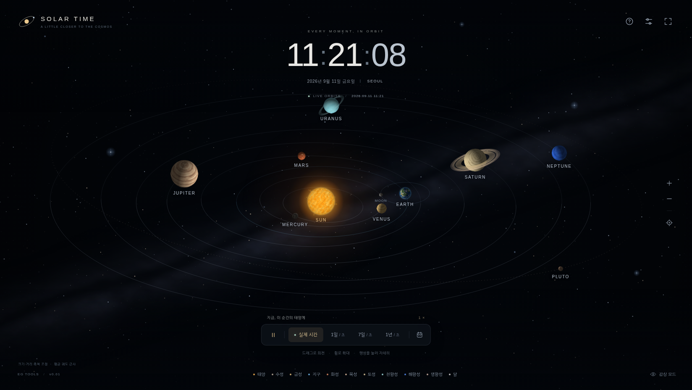

# SOLAR TIME

**EG Tools · v0.01**

별빛과 함께 흐르는 태양계 시계. 실제 기기 시각을 표시하고, 같은 시간축 위에서 태양·8개 행성·지구의 달·명왕성을 그립니다.



## 바로 실행

`dist/Solar-Time_v0.01.html`을 더블클릭해 Edge 또는 Chrome에서 여세요. 설치, 로그인, 인터넷 연결, API 키가 필요하지 않습니다.

프로젝트를 수정할 때는 루트의 `index.html`을 열면 됩니다. 모든 런타임 코드는 기본 JavaScript, CSS, Canvas 2D이며, npm 패키지나 CDN에 의존하지 않습니다.

## 화면과 움직임

- 별은 서로 다른 간격으로 짧고 부드럽게 반짝입니다. 태양은 표면 흐름, 코로나와 홍염 효과로 움직입니다.
- 행성 위치와 궤도선은 같은 궤도 좌표식을 사용합니다. 지구의 달은 지구 위치를 중심으로 공전합니다.
- 기본 카메라는 45도입니다. 넓은 화면에서는 궤도 투영을 가로로 확장하는 시네마틱 구도를 사용하고, 행성 표시는 원형을 유지합니다.
- 행성의 표면, 구름, 별 배경은 코드로 생성합니다. 제공받은 참고 이미지는 실행 파일이나 저장소에 포함하지 않습니다.
- 명왕성은 왜행성으로 구분하며 점선 궤도를 사용합니다. 소행성대는 넣지 않았습니다.

## 시간 조작

**위쪽 큰 시계는 항상 실제 기기 시각입니다.** 재생 속도나 날짜를 바꿔도 이 시계를 배속하지 않습니다. 실제 시각의 정확도는 기기 시계 설정에 따르며, 외부 시간 서버에 접속하지 않습니다.

| 조작 | 태양계의 동작 |
| --- | --- |
| 실제 시간 | 현재 기기 시각으로 돌아가 1배속으로 공전 |
| 1일 / 초 | 실제 1초마다 시뮬레이션 1일 진행 |
| 7일 / 초 | 실제 1초마다 시뮬레이션 7일 진행 |
| 1년 / 초 | 실제 1초마다 시뮬레이션 365.25일 진행 |
| 일시정지 | 공전, 태양 효과, 별 반짝임 정지. 실제 시계는 계속 표시 |
| 날짜 선택 | 선택한 날짜로 이동한 뒤 일시정지. 배속 버튼으로 재생 |

모든 천체에 같은 시간 배율을 적용합니다. 감상을 위해 바깥 행성만 별도로 빠르게 돌리지 않습니다. 따라서 실제 시간 모드에서는 행성의 공전이 눈에 거의 보이지 않을 수 있습니다.

실제 시간 모드에서 일시정지를 해제하면 현재 시각으로 다시 동기화합니다. 배속 모드에서는 멈췄던 시뮬레이션 시점부터 이어집니다. 비활성 탭에서는 렌더링을 중단하지만, 재생 중인 시뮬레이션 시간은 기준 시각으로부터 계산하므로 돌아왔을 때 경과 시간을 반영합니다.

## 화면 조작

마우스로 드래그하면 시점이 회전하고, 휠로 확대·축소합니다. 모바일에서는 한 손가락 회전과 두 손가락 확대·축소를 지원합니다. `+`, `−`, 기본 시점 버튼도 제공합니다.

행성 또는 하단 천체 이름을 누르면 설명과 근사 공전 정보를 확인할 수 있습니다. 하단 천체 목록은 키보드로도 접근할 수 있습니다. 휴대폰에서는 목록을 가로로 스크롤합니다.

| 키 | 기능 |
| --- | --- |
| Space | 공전 일시정지 / 재생 |
| R | 실제 시간으로 돌아가기 |
| F | 전체 화면 전환 |
| H | 조작부를 숨기는 감상 모드 |
| 0 | 기본 카메라와 배율 |
| + / − | 확대 / 축소 |
| 방향키 | 태양계 캔버스에 포커스가 있을 때 시점 조절 |
| Esc | 패널 또는 대화상자 닫기 / 감상 모드 종료 |

설정에서 궤도, 이름, 별 반짝임, 태양 효과, 달, 명왕성을 각각 켜거나 끌 수 있습니다. 저전력 모드는 프레임과 픽셀 비율을 낮춥니다. 설정은 해당 브라우저에만 저장하며, 저장 기능이 차단되어도 앱은 실행됩니다. 시스템의 동작 줄이기 설정이 있으면 장식 애니메이션을 기본으로 끕니다.

## 계산 기준과 한계

이 앱은 **시계와 감상용 태양계 시각화**입니다. 관측 장비의 조준, 항법, 엄밀한 천문력, 월식·일식 예측용이 아닙니다.

8개 행성은 NASA JPL의 3000 BC–3000 AD 근사 궤도 요소(Table 2a)와 외행성 보정항(Table 2b)을 사용합니다. 케플러 방정식을 풀어 타원 궤도상의 위치를 계산합니다. 앱의 시뮬레이션 범위는 UTC 기준 1800년부터 2999년 말까지이며, 끝에 도달하면 자동으로 정지합니다. 표시 시간대에 따라 경계의 현지 날짜는 다를 수 있습니다.

지구는 지구·달 질량중심으로 근사합니다. 계산에서 UTC와 TDB의 차이는 생략합니다. 달은 약 27.321661일의 평균 항성 주기와 단순한 궤도면 기울기·교점 이동을 사용한 원 궤도입니다. 달의 밝은 면 수치는 이 모델로 구한 근사값이며 실제 월령과 다를 수 있습니다. 명왕성은 고정된 평균 케플러 궤도로 표현하며 JPL 정밀 천문력이 아닙니다.

행성마다 거리 축척을 다르게 압축하고 크기는 확대합니다. 달의 궤도도 보기 편하도록 확대합니다. 표면, 자전축의 절대 방향, 고리 방향, 태양 활동과 별 반짝임은 예술적 표현입니다. 배경 별빛은 실제 별자리 지도가 아닙니다.

자료:

- [NASA JPL — Approximate Positions of the Planets](https://ssd.jpl.nasa.gov/planets/approx_pos.html)
- [NASA — Moon Phases](https://science.nasa.gov/moon/moon-phases/)
- [NASA — Pluto Facts](https://science.nasa.gov/dwarf-planets/pluto/facts/)

## GitHub 저장소에 넣기

이 배포 파일은 `EG-Tools/Solar-Time`에 넣을 수 있는 전체 프로젝트입니다. **이 패키지를 만드는 과정에서 GitHub에 커밋하거나 배포하지는 않았습니다.**

압축을 푼 `Solar-Time` 폴더 **안의 내용**을 저장소 루트에 추가합니다. 루트에 `index.html`, `styles.css`, `src/`가 있는 구조를 유지하세요. ZIP 파일 자체만 업로드하면 웹사이트가 실행되지 않습니다.

GitHub Pages로 공개하려면 커밋 후 저장소의 `Settings → Pages`에서 `Deploy from a branch`, `main`, `/(root)`를 선택하고 저장하세요. 별도의 빌드 단계는 필요하지 않습니다. 포함된 `.nojekyll`은 정적 파일 그대로 게시하기 위한 파일입니다. Pages 설정을 저장하기 전에는 온라인 실행 주소가 만들어졌다고 가정하지 마세요.

[GitHub 공식 배포 설정 안내](https://docs.github.com/en/pages/getting-started-with-github-pages/configuring-a-publishing-source-for-your-github-pages-site)

## 파일 구조

```text
index.html                     웹사이트 진입점
styles.css                     반응형 UI
src/astro.js                   궤도 계산과 시뮬레이션 시계
src/renderer.js                별·태양·행성·고리·궤도 렌더러
src/app.js                     시간 표시, 입력, 설정과 UI
package.json                   테스트 / 단일 HTML 생성 명령
.nojekyll                      GitHub Pages 정적 게시
.gitignore
README.md
dist/Solar-Time_v0.01.html      더블클릭으로 실행하는 단일 파일
tools/build.cjs                의존성 없는 단일 HTML 생성기
tests/astro.test.cjs            수치·시간 계산 회귀 테스트
tests/browser_test.py           오프라인 브라우저 회귀 테스트
docs/preview.png               실행 화면
docs/QA.md                     검증 내용과 범위
docs/browser-results.json      브라우저 테스트 결과
```

## 개발과 검증

Node.js 18 이상에서 다음 명령을 사용할 수 있습니다. `npm install`은 필요 없습니다.

```sh
npm test
npm run build
```

`npm run build`는 소스 파일을 `dist/Solar-Time_v0.01.html` 한 파일로 묶습니다. 소스를 고친 뒤 단일 실행 파일도 갱신하려면 다시 실행하세요.

브라우저 테스트는 Python Playwright와 Chromium이 별도로 있는 개발 환경에서 실행합니다. 필요하면 `CHROMIUM_PATH` 환경변수로 Chromium 실행 파일 경로를 지정합니다.

```sh
python tests/browser_test.py
```

검증: 수치·시간 계산 18개 테스트와 데스크톱·모바일 Chromium UI 41개 확인 항목이 통과했습니다. 자세한 실행 환경과 테스트하지 못한 범위는 `docs/QA.md`에 기록했습니다.
